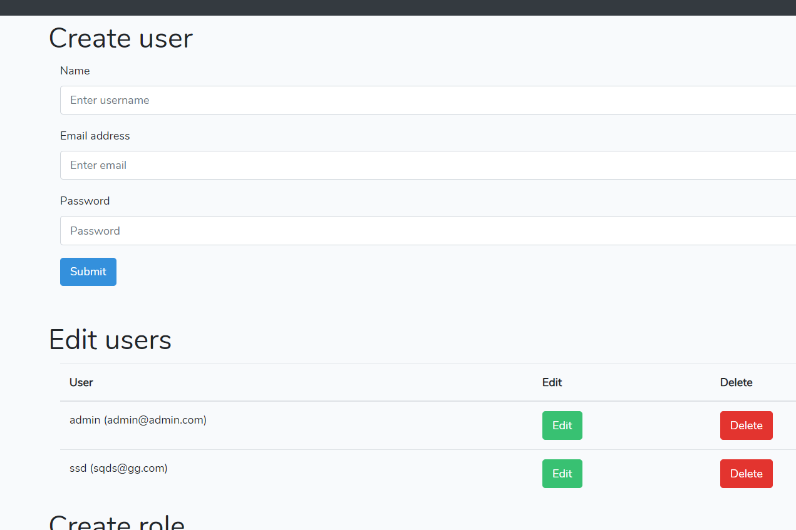

# laravel-simple-admin-panel
A super simple pure PHP admin panel for laravel (current version 5.8), wihout any additionnal dependencies required (default laravel install). Allows user management and role creation.
A lot of admin panels already exist, but I couldn't find any that did not include crazy fancy features or used non default packages.

# Introduction
This is a very simple Admin panel for your laravel website, which you can use as a base to build upon without needing to browse for hours through source code.

# Features
- User creation / edit / deletion
- Role creation / edit / suppression
- Role assignment
- Access control based on these roles




# Getting started

Simply clone the repository, then run
```
php artisan:migrate
```
and 
```
php artisan db:seed
```
and you are set. db:seed will create a user admin@admin.com / with password secret_password which you can use to login to the admin interface located at /admin

Everything is the same as the base laravel install except that admin panel and the user management functions.

You can use Route::group(['middleware' => 'admin:yourrole1,yourrole2'] from the admin middleware to restrict routes to only users having (at least one of) your self defined roles.

# Content

- Middleware/Admin.php: Middleware "admin" to restrict access to routes
- Role, User, UserRoleMapping: Models for the roles
- Controllers/UserController & Controllers/RoleController: Controllers that handle the admin panel
- Routes/web.php: The default route file with the addition of new routes for the admin panel
- view/admin: The blade views for the admin interface

# Integrating into an existing project
If you just want to add the admin panel,
- Run the migration (or at least the add_admin_roles one)
- Add the views in resources/views/admin
- Add the Admin middleware
- Add the two controllers

And you should be set!
